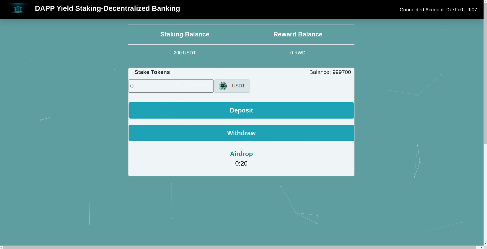
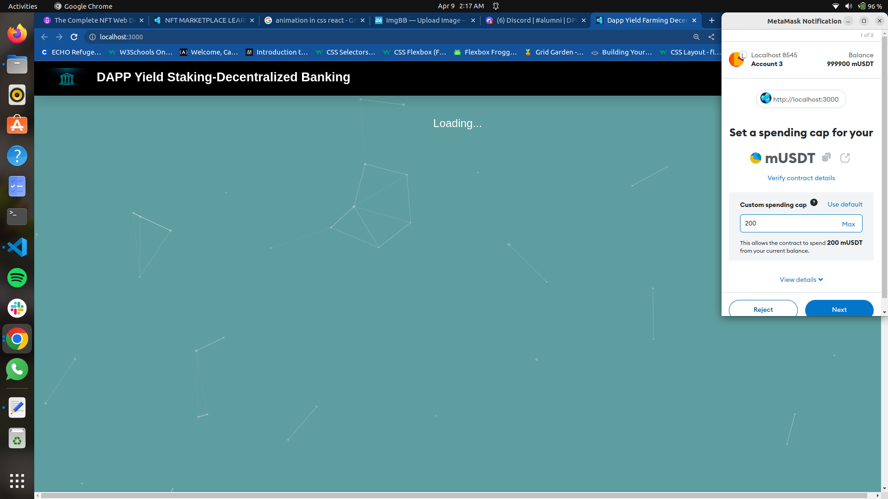

# Defi-Staking-App

### cd into the directory and Install the necessary packages

```shell
npm install
```

### Make sure truffle -g is installed

### use truffle compiile

(compile contracts)

### use truffle migrate --reset

(migrate contracts on the blockchain)

### use truffle test

to run Moch and Chai testing suite

### to start the server run

```shell
npm run start
```



